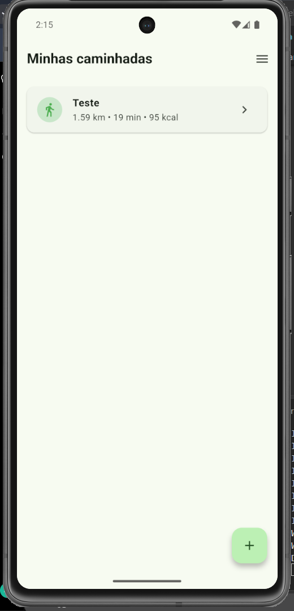
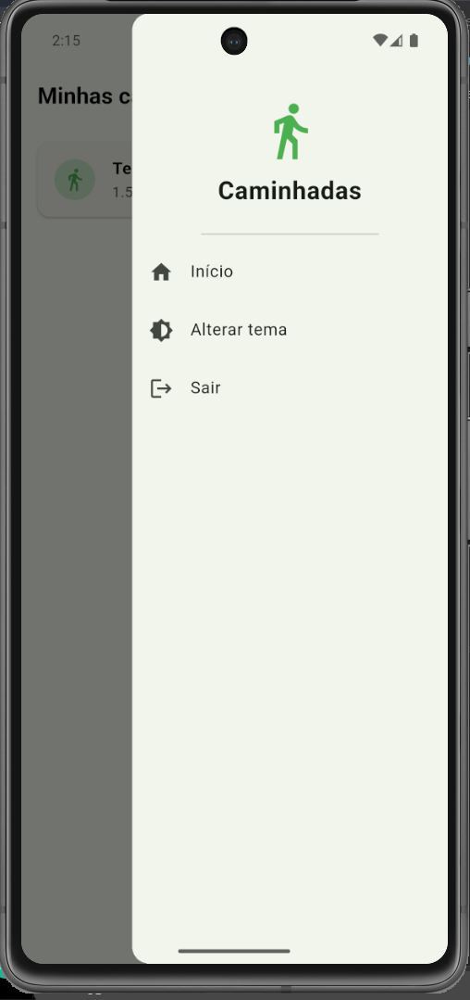
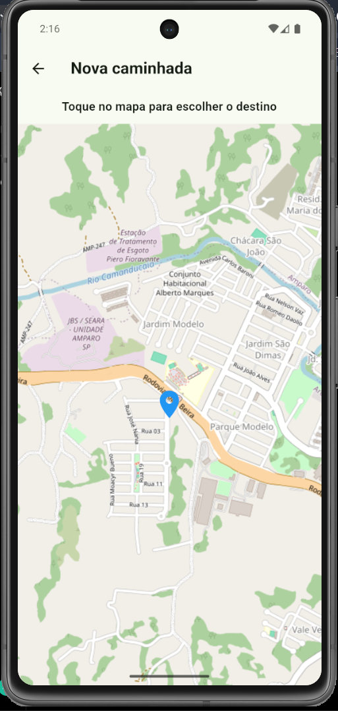
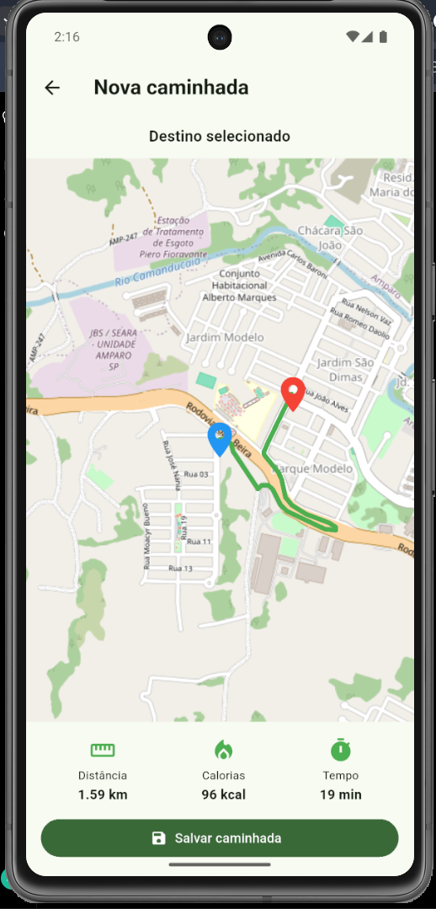
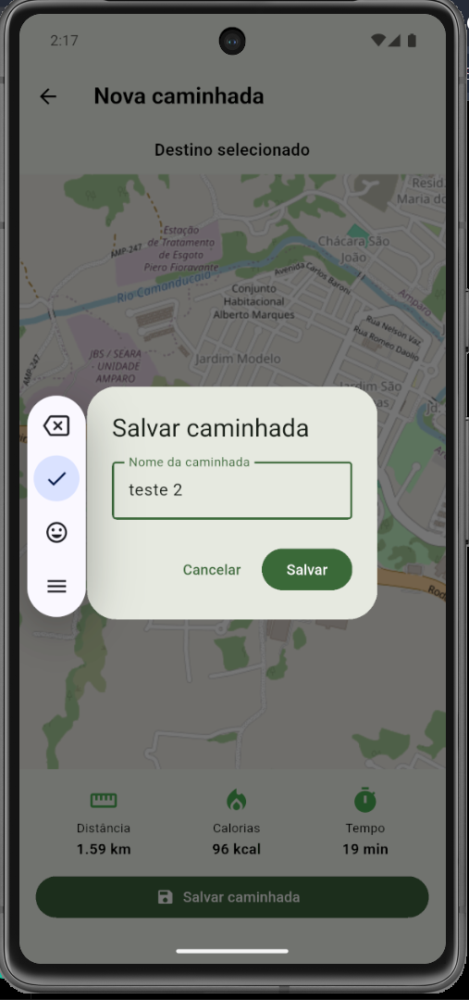

#  Caminhadas

Aplicativo desenvolvido para a atividade final da **Aula 05 - Mapas**, do curso de Desenvolvimento de Sistemas do SENAI.

O aplicativo permite criar e registrar caminhadas, escolhendo um destino no mapa, calculando a distância, o tempo estimado e as calorias gastas. As caminhadas ficam salvas localmente para serem consultadas posteriormente.

##  Funcionalidades

- Splash Screen com animação
- Tela inicial com lista de caminhadas
- Menu lateral
- Alternância entre tema claro e escuro
- Seleção de destino diretamente no mapa
- Traçado da rota entre dois pontos
- Cálculo da distância da caminhada
- Estimativa de calorias gastas
- Estimativa do tempo de caminhada
- Salvamento das caminhadas localmente
- Tela de detalhes da caminhada
- Adição de fotos utilizando a câmera do dispositivo

##  Tecnologias utilizadas

- Flutter
- Dart
- Flutter Map
- OpenStreetMap
- OSRM
- SharedPreferences
- Image Picker

##  Mapas e rotas

O aplicativo utiliza o **Flutter Map** para exibição dos mapas e o **OpenStreetMap** como fonte dos mapas.

Para calcular e traçar as rotas, foi utilizada a API do **OSRM (Open Source Routing Machine)**.

##  Armazenamento

As caminhadas são armazenadas localmente no dispositivo utilizando o pacote **SharedPreferences**, permitindo que os registros continuem disponíveis mesmo depois de fechar e abrir o aplicativo novamente.

##  Telas do aplicativo

### Splash Screen


### Tela inicial



### Menu



### Nova caminhada



### Rota e informações da caminhada



### Detalhes da caminhada



##  Como executar o projeto

### Pré-requisitos

É necessário ter instalado:

- Flutter
- Dart
- Android Studio
- Android SDK
- Emulador Android ou dispositivo físico

### Instalação

Clone o repositório:

```bash
git clone https://github.com/analivia4276/caminhadas.git
